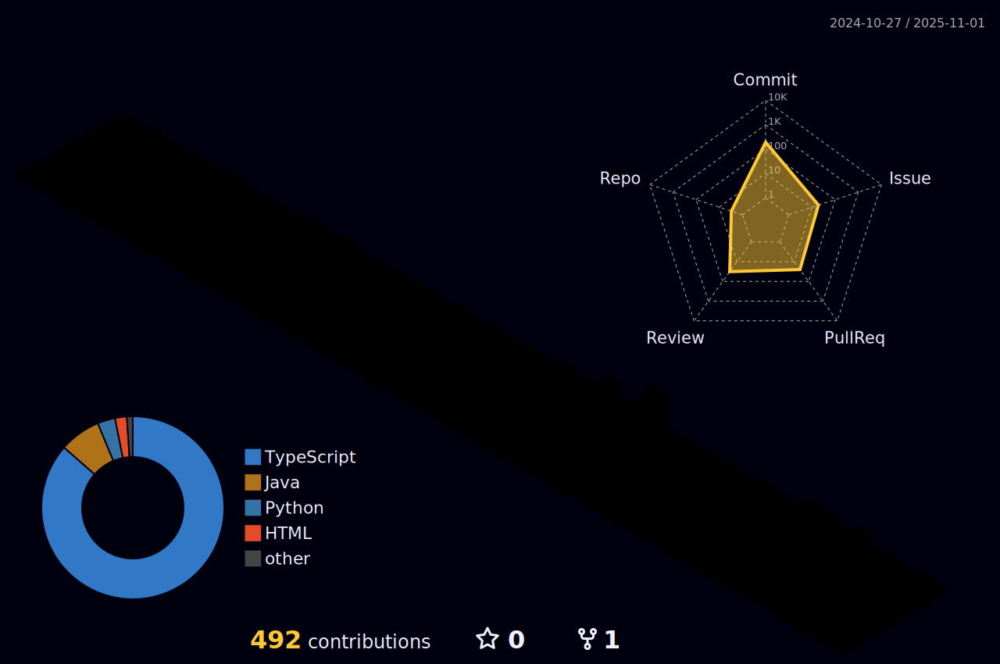

### 💬 About me

I am a 19 year old french student, working to get the **Full Stack developer** status. I'm currently in BUT INFO, where I learn some things about programming and around that. I still learn various things in my spare time and, I enjoy discovering new features and programming languages as well as new technologies.
I avoided frameworks until soon when I learnt `NextJS`, and I will learn multiple others, like `Vue.js` at school, but I'll keep learning on my side (things like `C++`/`C#`/`Angular`) while making projects to apply my skills.

I discovered programming in Jr High school, where I started to ask myself how does games actually work. Then, I started reading and learning some things on my side, coding little things for myself in Java using the *Spigot API*, made for Minecraft plugins usage. Later on, I met a friend who taught me all the `Java` and programming essentials I did not know by the time.
I started coding for friends, while keeping in touch with new updates. Then I discovered `Python` in high school and used that during all high school and even now in uni.
I learnt `C` and `RISC Assembly`, `JavaScript`, `jQuery`, Web development (deeper that I already knew) and `Java` (that I already knew). 

For my second year of BUT, I had the possibility to get an apprenticeship, as long as I find the contract myself. It wasn't easy, but I found one. There, I'm doing a lot of things, like C# .NET application using Blazor, Artificial Intelligence to fine-tune an OCR in Python using Deep Learning technologies, installing new servers in our datacenters, and there more!
I'm litteraly doing everything related the IT and that's what I was hoping to find, from development to technical installations to network administration, including Docker etc..
There's still plenty of things for me to learn here and I'm really happy to discover things in that context.

I'm currently in sencond year of by diploma, and I will still discover new things in the future. 😉

### ⚙️ Skills

#### (Mostly used) Frontend

  
  
  
  

#### Mostly used in backend

### 🔭 Achievements
I got to participate to the CGL 2023, which is a national programming contest (even if it's on paper).

I also participated to the Nuit du c0de 2023, which is a 6 hours long coding contest.

I also did the 24h INFO, a cross-IUT contest with 24 hours of non-stop programming. It has 3 parts of 8 hours : algorithm, web and crypto/cybersecurity.

In 2024, I contested in the "Nuit de l'info". This is a competition where teams among every IUT from France get a national subject, along with various challenges, and they should organize themselves to code a website in a single night (meaning 16 hours non-stop). That was fun !

### 📫 How to reach me:
- Discord : noway_y

### 🌟 Activity

